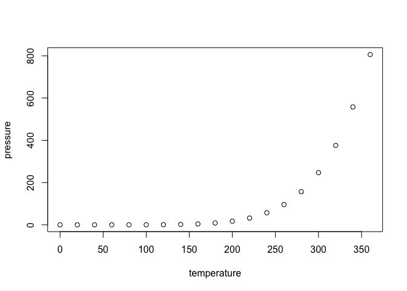

Code
================
Helena
13/10/2020

# Let’s get started

First load the necessary packages (these contain the functions we will
use) and the data. (Don’t laugh at the file path - I forgot R Studio
automatically creates a file and by the time I remembered I couldn’t
correct it).

``` r
library(dslabs)
library(tidyverse)
library(dplyr)
library(ggplot2)

cases <- read.csv("~/Desktop/uk_covid19_2/uk_covid19_2/2020-10-10/data_2020-Oct-09.csv")
```

## R Markdown

This is an R Markdown document. Markdown is a simple formatting syntax
for authoring HTML, PDF, and MS Word documents. For more details on
using R Markdown see <http://rmarkdown.rstudio.com>.

When you click the **Knit** button a document will be generated that
includes both content as well as the output of any embedded R code
chunks within the document. You can embed an R code chunk like this:

## Including Plots

You can also embed plots, for example:

<!-- -->

Note that the `echo = FALSE` parameter was added to the code chunk to
prevent printing of the R code that generated the plot.
